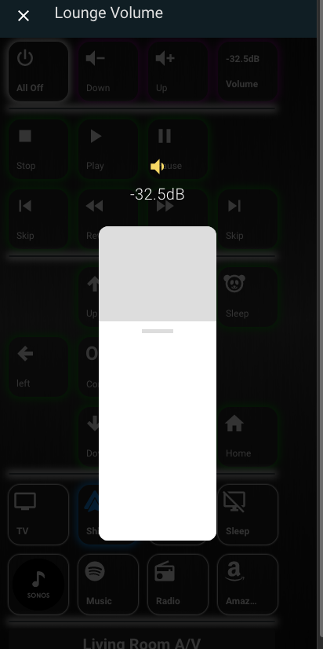
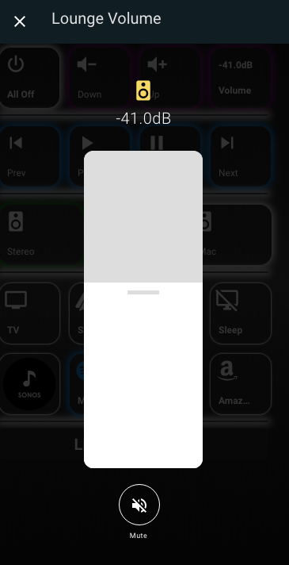

# Input number popup card for those using Input Numbers for Volume control (homekit style) (Thanks to DBUIT for the hard work)
Popup lovelace card with volume slider and optional actions to add more control for input number controlled media players.
Can be used in combination with thomas loven browser_mod or custom pop-up card or in combination with DBuit's homekit style card: https://github.com/DBuit/Homekit-panel-card

The buy me a coffe link buys DBUIT a coffee as he did all the hard work

<a href="https://www.buymeacoffee.com/ZrUK14i" target="_blank"></a>

## Configuration

### Installation instructions

**Manual installation:**
Copy the .js file from the dist directory to your www directory and add the following to your ui-lovelace.yaml file:

```yaml
resources:
  url: /local/input_number-popup-card.js
  type: module
```

### Main Options

| Name | Type | Default | Supported options | Description |
| -------------- | ----------- | ------------ | ------------------------------------------------ | --------------------------------------------------------------------------------------------------------------------------------------------------------------------------------------------------------------------------------------------------------------------------------------------------------------------------------------------- |
| `entity` | string | **Required** | `input_number.avr_volume` | Entity of the input number |
| `icon` | string | optional | `mdi:speaker` | It will use customize entity icon or from the config as a fallback it used speaker icon |
| `fullscreen` | boolean | optional | true | If false it will remove the pop-up wrapper which makes it fullscreen |
| `actions` | object | optional | `actions:`  | define actions that you can activate from the pop-up. |
| `actionSize` | string | optional | `50px`  | Set the size of the action buttons default `50px` |
| `actionsInARow` | number | optional | 3 | number of actions that will be placed in a row under the slider |
| `sliderWidth` | string | optional | 150px | The width of the slider |
| `sliderHeight` | string | optional | 400px | The height of the slider |
' `borderRadius` | string | optional | 12px | The border radius of the slider and switch |
| `sliderColor` | string | optional | "#FFF" | The color of the slider |
| `sliderThumbColor` | string | optional | "#ddd" | The color of the line that you use to slide the slider  |
| `sliderTrackColor` | string | optional | "#ddd" | The color of the slider track |
| `sliderMin` | string | optional | Input Number Min | The miniumn value for the slider |
| `sliderMax` | string | optional | Input number Max | The maximum value of the slider |
| `sliderStep` | string | optional | Input Number step | The stepping value the slider track |
| `sliderUnits` | string | optional | Input number units | The units of the slider |
| `settings` | boolean | optional | false | When it will add a settings button that displays the more-info content see settings example for DBUIT's light popup for more options/information [here](https://github.com/DBuit/light-popup-card#settings) |
| `settingsPosition` | string | optional | `bottom`  | set position of the settings button options: `top` or `bottom`. |

You may need to set the style of the card:
```
  sensor.avr_volume_display:
    style:
      $: |
        .mdc-dialog .mdc-dialog__container {
          width: 100%;
        }
        .mdc-dialog .mdc-dialog__container .mdc-dialog__surface {
          width:100%;
          box-shadow:none;
        }
      .: |
        :host {
          --mdc-theme-surface: rgba(0,0,0,0);
          --secondary-background-color: rgba(0,0,0,0);
          --ha-card-background: rgba(0,0,0,0);
          --mdc-dialog-scrim-color: rgba(0,0,0,0.8);
          --mdc-dialog-min-height: 100%;
          --mdc-dialog-min-width: 100%;
          --mdc-dialog-max-width: 100%;
        }
        mwc-icon-button {
          color: #FFF;
        }      
```

Card config example:
```
card:
   entity: input_number.avr_volume
   type: 'custom:input_number-popup-card'
   sliderMax: -10
   sliderMin: -80
   sliderStep: 0.5
   sliderUnits: 'dB'
title: Lounge Volume
```

Or you can leave the slider values out and the values from your input_number settings will be used or override the maximum or whichever combination you wish.
```
card:
   entity: input_number.avr_volume
   type: 'custom:input_number-popup-card'
   sliderMax: -30
   sliderStep: 2
title: Lounge Volume
```

To show actions in the pop-up you add `actions:` in the config of the card follow bij multiple actions.
These actions are calling a service with specific service data.
```
actions:
  - service: homeassistant.toggle
    service_data:
      entity_id: switch.avr_mute
    name: Mute
    icon: mdi:volume-off
```
The name option within a scene is **optional**
You can also set the `entity_id` with value **this** if you use **this** it will be replaced with the entity the pop-up is opened for.


Example configuration with next, play/pause and previous actions
```
type: custom:input_number-popup-card
actions:
  - service: media_player.media_previous_track
    service_data:
      entity_id: media_player.spotify
    name: previous
    icon: mdi:skip-previous
  - service: media_player.media_play_pause
    service_data:
      entity_id: media_player.spotify
    name: play/pause
    icon: mdi:play-pause
  - service: media_player.media_next_track
    service_data:
      entity_id: media_player.spotify
    name: next
    icon: mdi:skip-next
```

### Screenshot

 


